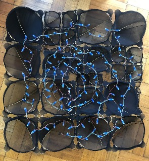
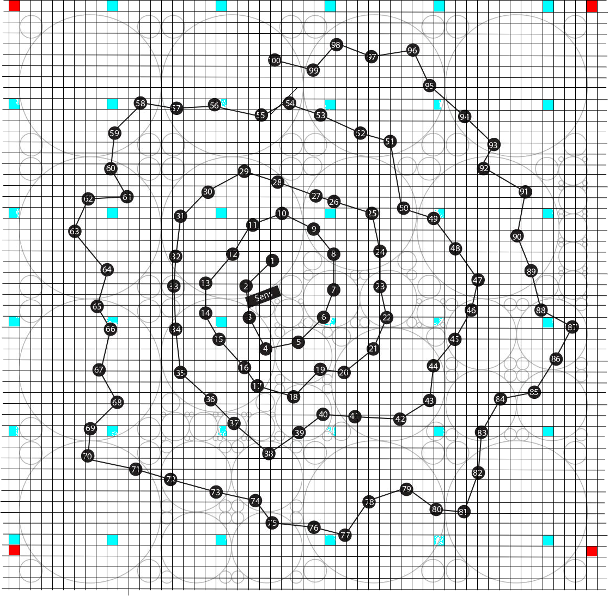

# Evoluciones-Sensibles
Source code of **Lucía Rosselot**'s project: ```Evoluciones Sensibles```.

Pontificia Universidad Católica de Chile, Escuela de Diseño, 2020.

 

## Core Resources

* *Getting started with MicroPython on the ESP32*: https://docs.micropython.org/en/latest/esp32/tutorial/intro.html

* *Controlling NeoPixels*: https://docs.micropython.org/en/latest/esp8266/tutorial/neopixel.html

* *_thread in ESP32*: https://docs.pycom.io/firmwareapi/micropython/_thread/#app

* *Python threads*: https://www.youtube.com/watch?v=IEEhzQoKtQU

* *HC-SR04 Sensor Driver in Mipropython*: https://github.com/rsc1975/micropython-hcsr04

* *ESP32 firmware*: https://micropython.org/download/esp32/

* *Ampy documentation and usage*: https://cdn-learn.adafruit.com/downloads/pdf/micropython-basics-load-files-and-run-code.pdf


## Useful Commands

* esptool.py -p /dev/ttyUSB0 erase_flash

* esptool.py --chip esp32 --port /dev/ttyUSB0 write_flash -z 0x1000 firmware/esp32-idf3-20200902-v1.13.bin

* ampy --port /dev/ttyUSB0 ls

* ampy --port /dev/ttyUSB0 get boot.py

* cu -l /dev/ttyUSB0 -s 115200
    ~.

## Quick Routines

* **Quick board reflash**:

```
esptool.py -p /dev/ttyUSB0 erase_flash
esptool.py --chip esp32 --port /dev/ttyUSB0 write_flash -z 0x1000 firmware/esp32-idf3-20200902-v1.13.bin
ampy --port /dev/ttyUSB0 ls
```

The final return of this routine should be

```
/boot.py
```

* **Quick project upload to board**:

```
ampy --port /dev/ttyUSB0 mkdir grid
ampy --port /dev/ttyUSB0 put Grid.txt src/grid/Grid.txt
ampy --port /dev/ttyUSB0 put src/lib
ampy --port /dev/ttyUSB0 put src/main.py
ampy --port /dev/ttyUSB0 ls
```

The final return of this routine should be

```
/boot.py
/grid
/lib
/main.py
```

**Important**: This routine does not overwrite files of the lib directory that have been already uploaded.


## To Do


## Improvements:

* Addition of args handling in ```set_state_element_by_num``` and ```set_state_element_by_pos``` methods in order to decrease the  ``data_structures.py`` module length.
> Maybe MicroPython does not handle args and kwargs
